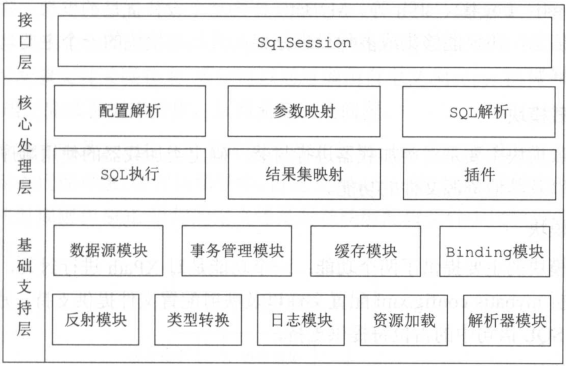
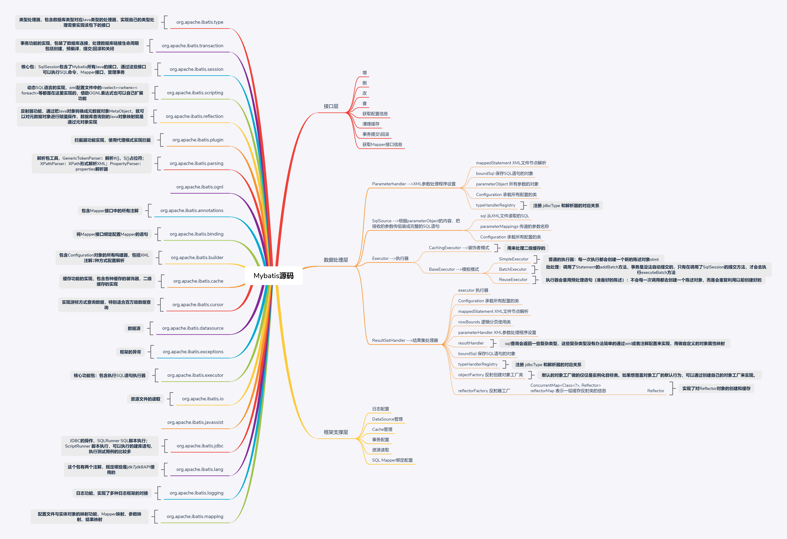

# mybatis-test
 **mybatis源码研究-2019/12/04**

***主要参考书籍：***  
> - [x] [MyBatis技术内幕  徐郡明  2017/07](https://pan.baidu.com/s/1-JGtoXADDjQRw5v51np4vA "提取码是fcak")  
> - [x] [MyBatis 3 源码深度解析  江荣波  2019/10](https://pan.baidu.com/s/1-JGtoXADDjQRw5v51np4vA "最新出版没有电子书")  
> - [x] [MyBatis从入门到精通  刘增辉  2017/07](https://pan.baidu.com/s/1-JGtoXADDjQRw5v51np4vA "提取码是fcak")   
> - [x] [深入浅出MyBatis 技术原理与实战  杨开振  2016/09](https://pan.baidu.com/s/1-JGtoXADDjQRw5v51np4vA "提取码是fcak")  

***mybatis整体架构***  
> mybatis整体架构分为三层，分别是基础支持层、核心处理层和接口层。
>   

***mybatis思维导图***
> 