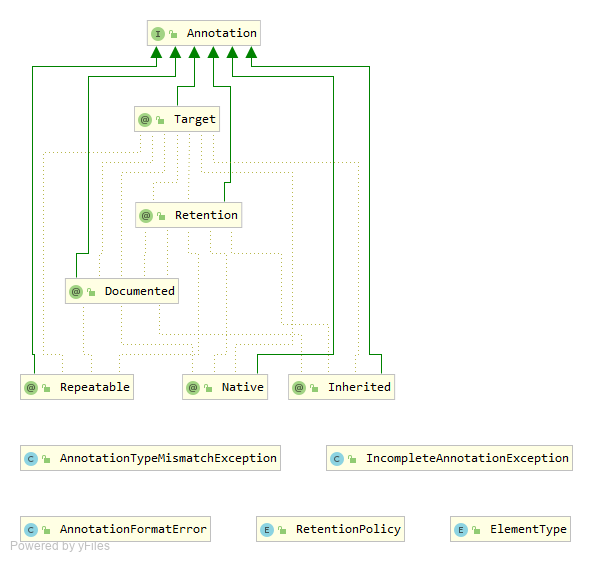
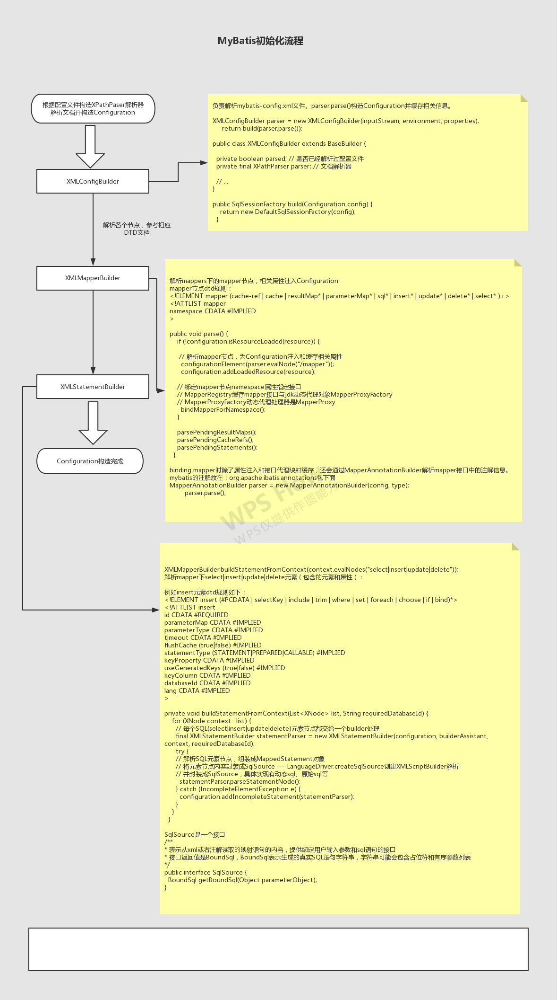
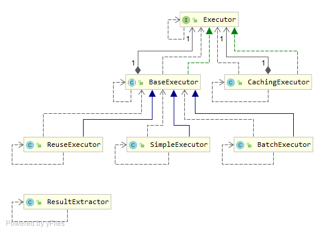
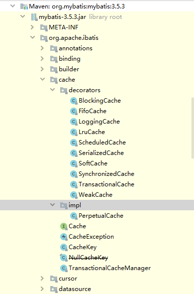

# mybatis-test
 
**mybatis源码研究-2019/12/04-2019/12/09**   
 教你一周精通mybatis（调试版本：3.5.3）
 从整体到局部，最后再回到整体，从全局把控mybatis各个模块；  
 1.自底向上分析法，先对基础控件描述并阐述相关实现原理，带着问题一步一步完成封装，最终形成整体。     
 2.从应用入手，自顶向下，挖掘实现机制，将具体模块一步一步细节拆解，最终形成深入全面的认识。       
 深挖mybatis所有核心知识点，真正掌握mybatis核心设计思想；    
 赠送各种流程图，思维导图。  
 
 
   
导航目录
=================

   * [mybatis-test](#mybatis-test)
   * [导航目录](#导航目录)
   * [开个头](#开个头)
      * [基本结构：](#基本结构)
      * [几个问题：](#几个问题)
   * [XML基础知识（名称空间/文档验证/文档处理）](#xml基础知识名称空间文档验证文档处理)
      * [XML](#xml)
      * [XML名称空间](#xml名称空间)
      * [DTD(Document Type Definition)](#dtddocument-type-definition)
         * [系统标识符：](#系统标识符)
         * [公共标识符：](#公共标识符)
         * [DTD详述](#dtd详述)
            * [元素声明](#元素声明)
               * [一个元素内容模型定义了可允许的元素内容。](#一个元素内容模型定义了可允许的元素内容)
               * [基数是指这个元素在内容模型中出现的次数。DTD有4个基数指示符。](#基数是指这个元素在内容模型中出现的次数dtd有4个基数指示符)
            * [属性声明](#属性声明)
      * [schema](#schema)
   * [Java高级特性](#java高级特性)
      * [再谈对象](#再谈对象)
         * [问题空间与解空间](#问题空间与解空间)
         * [面向对象特性](#面向对象特性)
      * [类型信息](#类型信息)
         * [反射操作---泛型、注解和动态代理](#反射操作---泛型注解和动态代理)
            * [注解：](#注解)
            * [泛型：](#泛型)
            * [JDK动态代理](#jdk动态代理)
   * [从头开始](#从头开始)
      * [mybatis初始化流程](#mybatis初始化流程)
      * [SqlSession运行原理解析](#sqlsession运行原理解析)
         * [Executor](#executor)
            * [BaseExecutor](#baseexecutor)
               * [一级缓存](#一级缓存)
               * [事务管理](#事务管理)
            * [sql操作具体实现](#sql操作具体实现)
            * [CachingExecutor 二级缓存](#cachingexecutor-二级缓存)
   * [JDBC](#jdbc)
   * [再回首](#再回首)
      * [作结](#作结)
         * [主要用到的设计模式](#主要用到的设计模式)
         * [本文抽象出的3大知识板块](#本文抽象出的3大知识板块)
         * [留点东(wen)西(ti)](#留点东wen西ti)
   * [<em><strong>mybatis思维导图</strong></em>](#mybatis思维导图)
   * [<em><strong>主要参考资料：</strong></em>](#主要参考资料) 

****
***mybatis整体架构***  

mybatis整体架构分为三层，分别是基础支持层、核心处理层和接口层。  
>     

****
# 开个头
参考项目代码~~~    
## 基本结构：  

    全局配置文件   mybatis-config.xml
    映射配置文件   UserMapper.xml
    方法接口      UserMapper
    结果集/实体   UserEntiry  

## 几个问题：    
  1. 读写配置文件，如何封装，提取配置的SQL语句并解析  Configuration MapperProxy MappedStatement  
  2. 接口在哪里实现，怎么实现，SQL如何执行 SqlSession Executor TypeHandler      
  3. 结果集映射返回期望的Java类型 ResultSetHandler  
  4. 对扩展开放   plugins  

# XML基础知识（名称空间/文档验证/文档处理）

## XML
所有的 XML 文档（以及 HTML 文档）均由以下简单的构建模块构成：  

>   元素  
>   属性  
>   实体  
>   PCDATA  
>   CDATA   

## XML名称空间  
名称空间为了避免条目命名冲突  

## DTD(Document Type Definition)  

参考资料：
>  [XML入门经典(第5版)  第I部分-->第III部分](https://pan.baidu.com/s/1M3HSfL3VQgpVvHa_ekUjvQ "提取码是9mfm")

文档类型声明或DOCTYPE告诉解析器，XML文档必须遵循DTD定义。同时它也告诉解析器，到哪里找到文档定义的其余内容。  
`<!DOCTYPE name [ ]>`

引用外部DTD要用下面两种方法之一：系统标识符和公共标识符。

### 系统标识符：  
关键字SYSTEM和指向文档位置的URI引用。URI可以是硬盘上的一个文件，也可以是局域网或者internet上的一个文件。  
`<!DOCTYPE name SYSTEM "name.dtd" [...]>`

### 公共标识符：  
以PUBLIC关键字开始，其后紧跟一个专用的标识符，但是公共标识不是用来表示对文件的引用，而是表示目录中的一个记录。
根据XML规范，公共标识符可以采用任何格式，但是一种经常使用的格式是正式公共标识符(Formal Public Identifier, FPI)。
>	FPI的语法要匹配下面的基本结构：  
>	    -//Owner//Class Description//Language//Version  
>   从底层的角度看，它与名称空间的作用相似，但是公共标识符不能把两个不同的词汇组合到同一个文档里。所以名称空间比它功能更强大。  

在标识符字符串之后，还可以插入一个可选的系统标识符。这样，当处理器不能解析公共标识符时，可以查找这个文档的副本（大多数处理器    
不能解析公共标识符）。    
`<!DOCTYPE name PUBLIC "-//Beginning XML//DTD Name Example//EN" "name.dtd">`

### DTD详述
通常，DTD由三个基本部分组成：  
* 元素声明  
* 属性声明  
* 实体声明  

#### 元素声明
由三个部分组成：ELEMENT声明 元素名 元素内容模型
``` XML  
<!ELEMENT name (first, middle, last)>
```
ELEMENT声明告诉解析器当前声明一个元素。
##### 一个元素内容模型定义了可允许的元素内容。  
就XML标准而言，有四类内容文档。（FAQ. 重点，请自行查阅相关资料）  
* 元素内容
* 混合内容
* 空内容
* 任意内容
##### 基数是指这个元素在内容模型中出现的次数。DTD有4个基数指示符。

指示符	|	说明
--------|----------------
[none]	|内容模型中默认方式，表示这个元素必须且只出现一次
`?`		|表示元素出现一次或零次
`+`		|表示元素出现一次或多次
`*`		|表示元素出现零次或多次

#### 属性声明    
属性声明需要使用ATTLIST关键字。  
ATTLIST包含三个部分：ATTLIST关键字 相应元素名 属性列表  
``` xml
<!ELEMENT book (title, author*, publisher,isbn,price)>
<!ATTLIST book year CDATA #IMPLIED>
```
上面例子指出book元素包含year属性，CDATA用来定义属性类型，#IMPLIED指出该属性不是必须的。  
`ref:  https://www.w3school.com.cn/dtd/dtd_attributes.asp`  
       http://mybatis.org/dtd/mybatis-3-config.dtd    
       http://mybatis.org/dtd/mybatis-3-mapper.dtd    

## schema
XML Schema 参考手册：  
> https://www.w3school.com.cn/schema/schema_elements_ref.asp

    XML Schema 是基于 XML 的 DTD 替代者。XML Schema也称为XML框架或XML模式。通过Schema可以描述和规范XML文档的数据模式  
    和组织结构，规定XML文档中可以包含哪些元素、这些元素拥有哪些子元素及其出现的顺序和次数，还规定每个元素和属性的数据
    类型。与DTD相比，通过XML Schema可以更好地规范和验证有效的XML文档。  
    XML Schema总是以独立文档形式存在，其文件扩展名为.xsd。XML Schema文档本身就是一个符合XML规范的、格式良好的XML文  
    档，该文档通过一套预先定义的XML元素及其属性创建的，正是这些特定的元素和属性规定了XML文档的结构和内容模式。  

Schema文档从一个XML文档声明开始，其后的内容是对根元素schema的声明。根据需要，还可以从一个Schema文档中包含或导入其他Schema文档。  
eg. http://www.springframework.org/schema/beans/spring-beans-4.1.xsd  文档基本框架如下：
```xml
<?xml version="1.0" encoding="UTF-8" standalone="no"?>
<xsd:schema xmlns="http://www.springframework.org/schema/beans"
		xmlns:xsd="http://www.w3.org/2001/XMLSchema"
		targetNamespace="http://www.springframework.org/schema/beans">

	<xsd:import namespace="http://www.w3.org/XML/1998/namespace"/>
    <!--元素和属性声明-->
</xsd:schema>
```
    xmlns：指定该schema的默认名称空间
    targetNamespace：声明了在该xsd文档下定义的元素属于该命名空间
    schemaLocation：告诉验证器去哪里找到可用于验证的XML Schema文档

举个栗子：  
```java
    /** Default Servlet name used by Tomcat, Jetty, JBoss, and GlassFish */
	private static final String COMMON_DEFAULT_SERVLET_NAME = "default";
	/** Default Servlet name used by Google App Engine */
	private static final String GAE_DEFAULT_SERVLET_NAME = "_ah_default";
	/** Default Servlet name used by Resin */
	private static final String RESIN_DEFAULT_SERVLET_NAME = "resin-file";
	/** Default Servlet name used by WebLogic */
	private static final String WEBLOGIC_DEFAULT_SERVLET_NAME = "FileServlet";
	/** Default Servlet name used by WebSphere */
	private static final String WEBSPHERE_DEFAULT_SERVLET_NAME = "SimpleFileServlet";
``` 
如果web.xml中配置了某个servlet拦截了所有的请求，那么一些静态资源的访问如jpg，css，js也会被处理。      
```xml
<servlet-mapping>     
    <servlet-name>default</servlet-name>    
    <url-pattern>*.jpg</url-pattern>       
</servlet-mapping>      
<servlet-mapping>         
    <servlet-name>default</servlet-name>      
    <url-pattern>*.js</url-pattern>      
</servlet-mapping>      
<servlet-mapping>          
    <servlet-name>default</servlet-name>         
    <url-pattern>*.css</url-pattern>        
</servlet-mapping>
```
在springMVC-servlet.xml中配置：<mvc:default-servlet-handler/>   
这个元素声明在：http://www.springframework.org/schema/mvc/spring-mvc.xsd(FAQ. 自动匹配xsd版本?)    
删除文档注释，可以看到*复合类型元素default-servlet-handler有且只有一个default-servlet-name属性*，  
通过转发请求到Servlet容器的default-servlet从而达到对静态资源的处理。    
（具体实现请参考，笔者版本spring4.1.9：org.springframework.web.servlet.resource.DefaultServletHttpRequestHandler）    
```xml
<!--通过转发到Servlet容器的默认Servlet来配置用于提供静态资源的处理程序。-->
<xsd:element name="default-servlet-handler">
		<xsd:complexType>
			<xsd:attribute name="default-servlet-name" type="xsd:string">
			</xsd:attribute>
		</xsd:complexType>
	</xsd:element>
```
最后介绍一个xml/dtd转xsd工具[trang](https://pan.baidu.com/s/1BEhMthozcXUCnMRKvxi1pg "验证码：yc2a")
```dos
cd C:\Users\45554\Downloads\trang-20030619
java -jar .\trang.jar .\inventory.dtd inventory.xsd
```
FAQ. 自行比较DTD与XML schema  
FAQ. 阅读其他主题XPath、xslt、DOM、Java与xml等  
****

# Java高级特性

## 再谈对象
### 问题空间与解空间  
    程序员必须建立起在机器模型（位于“解空间”内，这是你对问题建模的地方，例如计算机）和实际待解问题的模型（位于“问题空间”内      
    这是问题存在的地方，例如一项业务）之间的关联。    
    面向对象方式将问题空间中的元素及其在解空间中的表示称为“对象”。这种思想的实质是：程序可以通过添加新类型的对象使自身适用与  
    某个特定问题。这是一种更灵活更强有力的语言抽象。  
    OOP中，用class表示数据类型；类描述了具有相同特性（数据元素）和行为（功能）的对象集合，一个类实际上就是一个数据类型。     
   [JAVA编程思想（第四版）ch01-对象导论](https://pan.baidu.com/s/1vbHMb3XRXato-jFv34HeQQ "验证码：p4th")     
### 面向对象特性
     ***多态的本质*** 
      前期绑定：编译器将产生对一个具体函数名字的调用，而运行时将这个调用解析到将要被执行的代码的绝对地址。
      OOP中，程序直到运行时才能确定代码地址。当消息发送到一个泛化对象时，使用了后期绑定，编译器确保被调用方法的存在，并对
      调用参数和返回值致性类型检查（无法提供此类保证的语言被称为是弱类型的），但是并不知道将要执行的确切代码。
      Java的动态绑定是默认行为（C++通过virtual关键字明确声明某个方法后期绑定）不需要额外关键字实现多态。  
      多态的作用是消除类型之间的耦合关系。多态通过分离做什么和怎么做，从另一个角度实现接口和实现分离（FAQ. 查阅OOP三大特  
      性（ch08-多态））。  
      
      “封装”通过合并特征和行为来创建新的数据类型。  
      继承允许将对象视为它自己本身的类型或其基类型来加以处理。这种能力极为重要，因为它允许将多种类型（从同一基类导出的）视为  
      同一类型，而同一份代码也就可以毫无差别地运行在这些不同类型之上了。
      多态方法调用根据方法行为的不同来表现类型之间的差别，尽管它们都可以通过同一个基类来调用。
      
    FAQ. 方法重载：what（表现形式）？why（为什么要重载方法）？who（怎么设计重载方法，如何查找到正确的方法来调用）？

## 类型信息
    每当编写并且编译一个新类就会产生一个Class对象，它被保存在一个同名的.class文件中。所有的类都是在对其第一次使用时，动态
    加载到JVM中的。无论何时，通过获得相应的Class对象的引用可以运行时使用类型信息。
    为使用类而做的准备工作包含三个步骤：
        加载，类加载器执行。该步骤将查找字节码，并从字节码中创建一个Class对象。
        链接，验证类中的字节码，为静态域分配存储空间，并且如果必需的话，将解析这个类创建的对其他类的所有引用。
        初始化，如果该类具有超类，则对其初始化，执行静态初始化器和静态初始化块。（类初始化是线程安全的）

### 反射操作---泛型、注解和动态代理
#### 注解：
   一种标记，用于对java说明，注释。  
   Java5.0定义了4个标准的meta-annotation类型，它们被用来提供对其它 annotation类型作说明。Java5.0定义的元注解：  
   @Target,@Retention,@Documented,@Inherited
   Java语言对注解的支持：  
   
   
####   泛型：
    泛型是jdk1.5引入的新特性，允许在定义类和接口的时候使用类型参数。
   ***类型擦除***   
   java的泛型基本是在编译器这个层次上实现的。在生成的java字节码中不包含泛型中的类型信息。  
   使用泛型时加上的类型参数，会被编译器在编译时擦除。
   
   类型擦除指的是通过类型参数合并，将泛型类型实例关联到同一份字节码上。编译器只为泛型类型生成一份字节码，并将其实例关联到这份  
   字节码上。类型擦除的关键在于从泛型类型中清除类型参数的相关信息，并且再必要的时候添加类型检查和类型转换的方法。    
      类型擦除可以简单的理解为将泛型java代码转换为普通java代码，只不过编译器更直接点，将泛型java代码直接转换成普通java字节码。      
        类型擦除的主要过程如下：    
        1.将所有的泛型参数用其最左边界（最顶级的父类型）类型替换。    
        2.移除所有的类型参数。  
   
   ***泛型支持***   
   为了表达泛型类型声明，JavaSE 5.0在java.lang.reflect包中提供了一个新的接口Type。这个接口包含下列子类型：    
   
```java
GenericArrayType (java.lang.reflect)
   GenericArrayTypeImpl (com.sun.xml.internal.bind.v2.model.nav)
   GenericArrayTypeImpl (sun.reflect.generics.reflectiveObjects)
   GenericArrayTypeImpl in TypeParameterResolver (org.apache.ibatis.reflection)
ParameterizedType (java.lang.reflect)
   ParameterizedTypeImpl in TypeParameterResolver (org.apache.ibatis.reflection)
   ParameterizedTypeImpl (com.sun.xml.internal.bind.v2.model.nav)
   ParameterizedTypeImpl (com.alibaba.fastjson.util)
   ParameterizedTypeImpl (sun.reflect.generics.reflectiveObjects)
WildcardType (java.lang.reflect)
   WildcardTypeImpl (sun.reflect.generics.reflectiveObjects)
   WildcardTypeImpl in TypeParameterResolver (org.apache.ibatis.reflection)
   WildcardTypeImpl (com.sun.xml.internal.bind.v2.model.nav)
   WildcardTypeImpl (com.sun.beans)
TypeVariable (java.lang.reflect)
   TypeVariableImpl (sun.reflect.generics.reflectiveObjects)
Class (java.lang)
```
   
   ***泛型与数组***  
   泛型擦除会移除参数类型信息，数组必须知道所持有的确切类型，以强制保证类型安全。  

#### JDK动态代理
   参考：package   org.pp.mybatis.foundationsupportlayer.reflector.proxy   
   描述文件 proxy.txt    
   测试类入口： Client.main    

关于模拟spring IOC请参考我的另一个repo：https://github.com/GitJavaProgramming/JavaAdvance/tree/master/src/reflection

# 从头开始
mybatis入口： SqlSessionFactoryBuilder读取xml文档，解析并构造Configuration，根据Configuration构造sqlSessionFactory  
sqlSessionFactory可以很轻易的拿到sqlSession，sqlSession提供系列操作方法,     
## mybatis初始化流程   
mybatis初始化之后Configuration、sqlSessionFactory均已构造完成。   

MapperRegistry中维护了实际类型（*Mapper接口,由mapper元素的namespace属性指定）和代理类的map映射    
提供两个泛型方法：      
public <T> void addMapper(Class<T> type)中传入的Class将会被MapperProxyFactory代理，代理处理器是MapperProxy    
public <T> T getMapper(Class<T> type, SqlSession sqlSession) 返回代理类实例（与被代理类是同一类型）  
  
    

## SqlSession运行原理解析

所有配置解析完成之后，mapper映射文件中，一个SQL元素节点被封装成一个MappedStatement对象，在SqlSession中注入全局配置单例    
Configuration通过元素id、MappedStatement映射可以找到对应MappedStatement对象，它包含了具体执行的sql字符串。      
MapperProxyFactory仅仅只是代理方法，由于接口不提供实现，所以需要自己实现方法处理逻辑，并提供返回值。   
`final MapperMethod mapperMethod = cachedMapperMethod(method);    
    return mapperMethod.execute(sqlSession, args); `    

具体实现在SqlSession中，SqlSession用到了缓存的MappedStatement执行真实的sql字符串；这是接口和实现分离思想的体现。    
同时这里用到了命令模式。
sqlSession javadoc：Through this interface you can execute commands, get mappers and manage transactions.。     
SqlSession接口对JDBC封装通过Executor接口实现，SqlSession类型负责提供高层对外访问接口。        
### Executor  
Executor Class Diagram：  
    

#### BaseExecutor  
BaseExecutor的基本实现提供内置的一级缓存管理和事务管理：    
##### 一级缓存
缓存由Cache接口定义，一级缓存是SqlSession内部缓存，Executor中localCache，localOutputParameterCache表示一级缓存：  
```java
/**
*  为每个namespace提供缓存一个实例  
*  缓存实现必须提供字符串（被定义为缓存id属性，提供getter）作为构造参数    
*/
public interface Cache {
  String getId();
  void putObject(Object key/*{@link CacheKey}*/, Object value);
  Object getObject(Object key);
  Object removeObject(Object key);
  void clear();
  int getSize();
  default ReadWriteLock getReadWriteLock() {
    return null;
  }
}
```
mybatis提供很多Cache实现，PerpetualCache提供基本实现，Cache装饰器类在org.apache.ibatis.cache.decorators包下面。     
  
如何设计CacheKey，提供全局唯一的key：从上往下找config->mapper->statement(sql, args)   
在Executor.createCacheKey中还用到了RowBounds（实现通用分页，个人感觉方法设计冗余，提供插件？）的相关属性offset，limit  
对于嵌套查询，BaseExecutor实现提供一个延迟加载队列，在query()方法执行时，会查询该队列并加载命中的缓存。  
（参考源码，mybatis 3.5.3在这里有几个issue）： 
mybatis issues列表： https://github.com/mybatis/mybatis-3/issues   
        
        例如 #482 https://github.com/mybatis/mybatis-3/issues/482
        这个问题是一个字符编码问题，描述以前的NStringHandler不支持国家字符集类型数据~~~
            Java String字符串类型与JdbcType转换  
              NVARCHAR(Types.NVARCHAR), // JDK6
              NCHAR(Types.NCHAR), // JDK6
              NCLOB(Types.NCLOB), // JDK6
            具体转换的类型会根据参数字符串长度和驱动定义的NVARCHAR值来确定
        TypeHandler完成单个参数/列值的类型转换
        NStringTypeHandler会在TypeHandlerRegistry中注册，这是已经修复问题了吧，注释没删掉吗???
        FAQ. 自行查阅关于char varchar NCHAR NVARCHAR 区别
```java
if (queryStack == 0) {
      for (DeferredLoad deferredLoad : deferredLoads) {
        deferredLoad.load();
      }
      // issue #601
      deferredLoads.clear();
      if (configuration.getLocalCacheScope() == LocalCacheScope.STATEMENT) {
        // issue #482
        clearLocalCache();
      }
    }
```
这里不再详述，读者可以结合JDBC自身情况来设计一个查询缓存，Cache接口已为你定义好了...    

##### 事务管理
Mybatis定义Transaction事务操作接口，它有两个实现JdbcTranscation、ManagedTransaction；  

#### sql操作具体实现

#### CachingExecutor 二级缓存

二级缓存是事务级别缓存，是一个全局缓存，被所有SqlSession(ref -> sqlSession javadoc)共享。      
CachingExecutor通过装饰模式组合Executor添加新功能，提供二级缓存功能。当然Cache的线程安全由自身保证。    

# JDBC

JDBC JSR221规范，当前4.3(oracle)草案，4.0(sun)为最终版。  

[JCP](https://www.jcp.org/en/home/index "JCP")  
[JSR221](https://www.jcp.org/en/jsr/detail?id=221 "jdbc规范")   
[JDBC4.0](./jdbc4.0-fr-spec.pdf "4.0")   
[JDBC4.0规范中文](https://www.jianshu.com/nb/15028668 "JDBC4.0规范")   

DataSource数据源实现 参考规范4.0 ch09---connections   

# 再回首

```java
        // 1. SqlSessionFactory build from config document and initialize all
        InputStream inputStream = Resources.getResourceAsStream("mybatis-config.xml");
        SqlSessionFactory sqlSessionFactory = new SqlSessionFactoryBuilder().build(inputStream);
        // 2. open session and new Executor
        SqlSession sqlSession = sqlSessionFactory.openSession();
        // 3. get MapperProxyFactory instance from cache for create MapperProxy
        UserMapper userMapper = sqlSession.getMapper(UserMapper.class);

        List<UserEntity> userList = userMapper.listAllUser();
        System.out.println(JSON.toJSONString(userList));
```
## 作结
mybatis很好的实践了面向接口编程。通过合理抽象、接口解耦实现了配置式的SQL控制。实践中大量用到面向接口编程、注册延后使用、  
动态代理和装饰器模式。  
### 主要用到的设计模式  
创建 singleton  factory builder     
结构 decorator     
对象行为​ command proxy    
类行为  template  
  
        关于结构：为了实现新功能，如何对一些对象进行组合。这样会形成更大的结构。
        关于行为：涉及到算法和对象间职责的分配，同时它描述了对象或类之间的通信模式。
            类行为：使用继承机制在类间分派行为。
            对象行为： 使用对象复合，这会使依赖关系复杂。所以需要对象解耦或者说进行对象关系维护。
        
### 本文抽象出的3大知识板块
* [XML基础知识（名称空间/文档验证/文档处理）](#xml基础知识名称空间文档验证文档处理)  
* [Java高级特性](#java高级特性)  
* [JDBC](#jdbc)  
### 留点东(wen)西(ti)
* OGNL    
* 高性能SQL与SQL优化    
* ResultSetHandler/TypeHandler    
* 插件（动态代理与注解）与扩展    

# ***mybatis思维导图***  
>   

# ***主要参考资料：***  
> - [x] [MyBatis技术内幕  徐郡明  2017/07](https://pan.baidu.com/s/1-JGtoXADDjQRw5v51np4vA "提取码是fcak")  
> - [x] [MyBatis 3 源码深度解析  江荣波  2019/10]     
> - [x] [MyBatis从入门到精通  刘增辉  2017/07](https://pan.baidu.com/s/1-JGtoXADDjQRw5v51np4vA "提取码是fcak")   
> - [x] [深入浅出MyBatis 技术原理与实战 杨开振 2016/09](https://pan.baidu.com/s/1-JGtoXADDjQRw5v51np4vA "提取码是fcak")  
> - [x] [xml](https://www.w3school.com.cn/xml/index.asp "W3CSchool") 
> - [x] [dtd](https://www.w3school.com.cn/dtd/dtd_entities.asp "W3CSchool") 
> - [x] [schema](https://www.w3school.com.cn/schema/index.asp "W3CSchool") 
> - [x] [xpath](https://www.w3school.com.cn/xpath/xpath_nodes.asp "W3CSchool") 
> - [x] [XML入门经典(第5版)  第I部分-->第III部分](https://pan.baidu.com/s/1M3HSfL3VQgpVvHa_ekUjvQ "提取码是9mfm")  
> - [x] [疯狂XML讲义](https://pan.baidu.com/s/1M3HSfL3VQgpVvHa_ekUjvQ "提取码是9mfm")  
> - [x] [XML揭秘 入门·应用·精通 Michael Morrison 陆新年](https://pan.baidu.com/s/1M3HSfL3VQgpVvHa_ekUjvQ "提取码是9mfm")  
> - [x] [《XML简明教程》2009年清华大学出版社出版 张欣毅]  
> - [x] [Java与XML](https://www.baidu.com "java访问xml")  
> - [x] [Java编程思想 第四版](https://pan.baidu.com/s/1Tz4rpgEwFg6Rcq9UqWTNOw "m912")  
> - [x] [Java核心技术I/II卷](https://pan.baidu.com/s/1Tz4rpgEwFg6Rcq9UqWTNOw "m912")  
> - [x] [C++程序设计教程（第二版） 钱能]   
> - [x] [深入理解Java虚拟机 JVM高级特性与最佳实践 第2版](https://pan.baidu.com/s/17mGl_Xu-dgWITfoD8V90HA "3tv9")  
> - [x] [Java深度历险](https://pan.baidu.com/s/1FTxaBmZPaiHKA4MPEF9p5g "rx5d")  
> - [x] [Java语言规范 基于Java SE 8](https://pan.baidu.com/s/1OSxrl5dZOvEHddAG4exNEA "wl1r")  
> - [x] [Java虚拟机规范  Java SE 8版](https://pan.baidu.com/s/14PjId4EJOHhyPxqQITaUTA "fvgs")   
> - [x] [设计模式-可复用面向对象软件的基础]  

